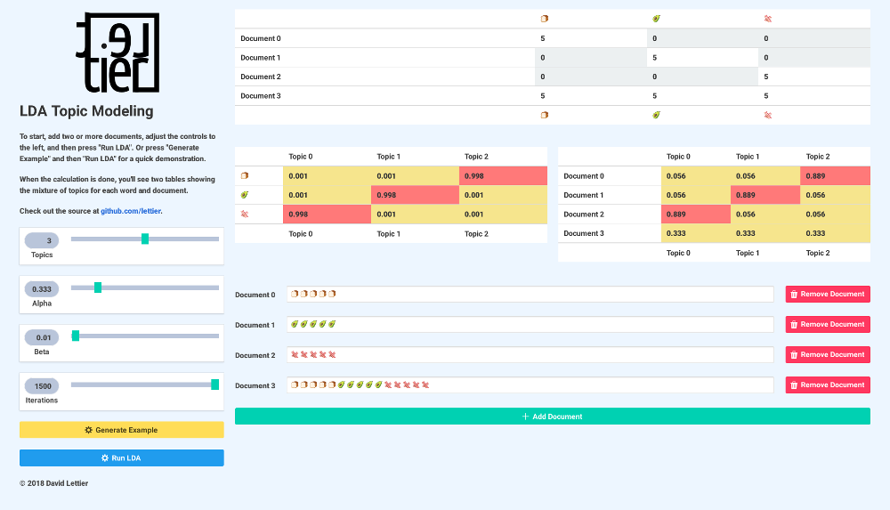

# LDA Topic Modeling

A PureScript, browser-based implementation of latent Dirichlet allocation (LDA) topic modeling.
Able to take in two or more documents and soft cluster them by up to four topics.  

Try it at [lettier.com/lda-topic-modeling](http://www.lettier.com/lda-topic-modeling/).
Read more about [LDA](https://medium.com/@lettier/how-does-lda-work-ill-explain-using-emoji-108abf40fa7d).

## Build and Run

```bash
# Install Git.
git clone git@github.com:lettier/lda-topic-modeling.git
cd lda-topic-modeling
# Install nvm and npm.
nvm use
npm install -g bower
npm install
bower install
npm run build
cd build/
nohup python -m http.server &> /dev/null &
python -mwebbrowser http://localhost:8000
```

## Copyright

(C) 2018 David Lettier  
[lettier.com](http://www.lettier.com/)
